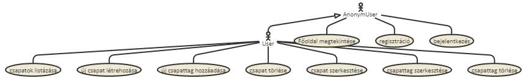

# TournamentGroupManager
Alkalmazások fejlesztése 1. Beadandó

## Követelményanalízis

A követelmény feltárás során felmérik és összegyűjtik a megrendelt szoftverrel szemben támasztott felhasználói követelményeket, elemzik az alkalmazási szakterületet. Részei:

1. Követelmények összegyűjtése: a nyújtandó szolgáltatások ismertetése rövid, szöveges leírásként, sokszor felsorolásként jelenik meg.
 * Funkcionális elvárások:
    * lehessen új csapatot létrehozni
    * lehessen csapattagokat hozzáadni meglévő csapathoz
    * lehessen hitelesített felhasználónak meglévő csapatot törölni
    * lehessen hitelesített felhasználónak meglévő csapatból csapattagot törölni
    * lehessen hitelesített felhasználónak meglévő csapatot szerkeszteni
    * lehessen hitelesített felhasználónak meglévő csapatból csapattagot szerkeszteni
    * lehessen listázni a meglévő csapatokat
 * Nem funkcionális követelmények
    * tartalmazzon két modellt, egy-sok kapcsolatban
    * perzisztálás fájlba történjen
    * közzététel Herokun
2. Szakterületi fogalomjegyzék: 
    * Csapat: egy vagy több tagból áll és névvel rendelkezik
    * Csapattag: névvel rendelkezik
3. Használatieset-modell
  * Szerepkörök: 
    * anonym user, minden user aki még nem autentikálta magát
    * autentikált user, aki már regisztrált és autentikálta magát
  * Használati eset diagramok:
  * 
  * Folyamatok pontos menete: legalább 1 folyamat kifejtése.
    * csapat szerkesztése
    * lépések
      1. a bejelentkezett felhasználó kilistázza a csapatokat
      2. kiválasztja a csapatot szerkesztésre
      3. a rendszer megjeleníti a csapat szerkesztőfelületét
      4. módosíthatja a csapat nevét
      5. törölhet csapattagot
      6. szerkeszthet csapattagot
      7. a felhasználó megnyomja a mentés gombot
      8. a rendszer elmenti a változtatásokat

## Tervezés

1. Architektúra terv
  * komponensdiagram
  * Oldaltérkép
  * Végpontok
2. Felhasználóifelület-modell
  * Oldalvázlatok
  * Designterv (nem kell, elég a végső megvalósítás kinézete)
3. Osztálymodell
  * Adatmodell
  * Adatbázisterv
  * Állapotdiagram
4. Dinamikus működés
  * Szekvenciadiagram

## Implementáció

1. Fejlesztői környezet bemutatása
2. Könyvtárstruktúrában lévő mappák funkiójának bemutatása

## Tesztelés

Automatikus tesztek szükségesek. Nem kell teljeskörű tesztelés, a hallgató mutassa meg, hogy képes ilyen tesztek írására.

1. Tesztelési környezet bemutatása
2. Egységtesztek: legalább 1 adatmodell tesztelése
3. Funkcionális felületi tesztek: legalább 1 folyamat tesztelése
    1. VAGY: Selenium IDE használatával
    2. VAGY: zombie.js használatával
4. Tesztesetek felsorolása: milyen eseteket próbált végig a hallgató

## Felhasználói dokumentáció

1. A futtatáshoz ajánlott hardver-, szoftver konfiguráció
2. Telepítés lépései: hogyan kerül a Githubról a célgépre a program
3. A program használata
