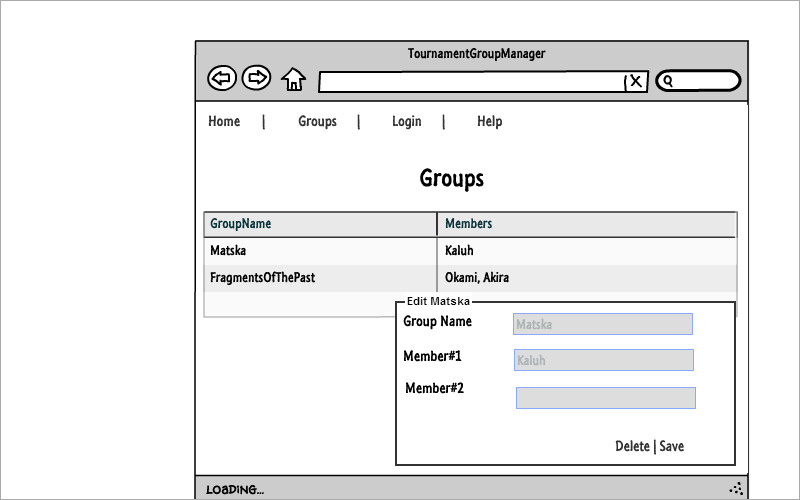
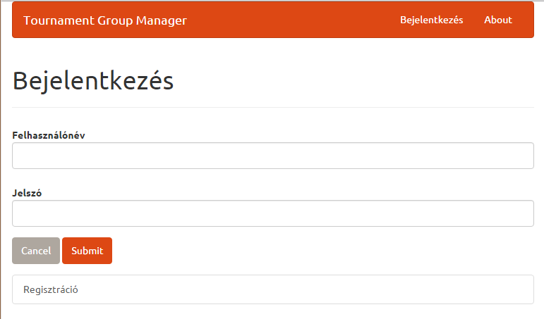
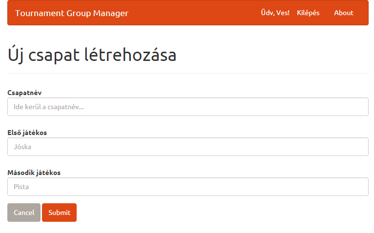
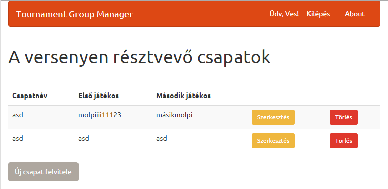
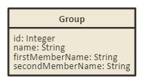
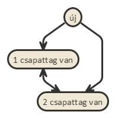

# TournamentGroupManager
Alkalmazások fejlesztése 1. Beadandó

## Követelményanalízis

A követelmény feltárás során felmérik és összegyűjtik a megrendelt szoftverrel szemben támasztott felhasználói követelményeket, elemzik az alkalmazási szakterületet. Részei:

1. Követelmények összegyűjtése: a nyújtandó szolgáltatások ismertetése rövid, szöveges leírásként, sokszor felsorolásként jelenik meg.
 * Funkcionális elvárások:
    * lehessen új csapatot létrehozni
    * lehessen csapattagokat hozzáadni meglévő csapathoz
    * lehessen hitelesített felhasználónak meglévő csapatot törölni
    * lehessen hitelesített felhasználónak meglévő csapatból csapattagot törölni
    * lehessen hitelesített felhasználónak meglévő csapatot szerkeszteni
    * lehessen hitelesített felhasználónak meglévő csapatból csapattagot szerkeszteni
    * lehessen listázni a meglévő csapatokat
 * Nem funkcionális követelmények
    * tartalmazzon két modellt, egy-sok kapcsolatban
    * perzisztálás fájlba történjen
    * közzététel Herokun
2. Szakterületi fogalomjegyzék: 
    * Csapat: egy vagy több tagból áll és névvel rendelkezik
    * Csapattag: névvel rendelkezik
3. Használatieset-modell
  * Szerepkörök: 
    * anonym user, minden user aki még nem autentikálta magát
    * autentikált user, aki már regisztrált és autentikálta magát
  * Használati eset diagramok:
  * 
  * Egy folyamat pontos menete:
    * csapat szerkesztése
    * lépések
      1. a bejelentkezett felhasználó kilistázza a csapatokat
      2. kiválasztja a csapatot szerkesztésre
      3. a rendszer megjeleníti a csapat szerkesztőfelületét
      4. módosíthatja a csapat nevét
      5. törölhet csapattagot
      6. szerkeszthet csapattagot
      7. a felhasználó megnyomja a mentés gombot
      8. a rendszer elmenti a változtatásokat

## Tervezés

### 1. Architektúra terv

  * komponensdiagram

#### Oldaltérkép

##### Anonym user

- Főoldal
- Help
- Login/Logout

##### Autentikált user

- Főoldal
- Help
- Login/Logout
- Csapatok listája
    + új csapat
    + csapat szerkesztése
      * csapattag hozzáadása
      * csapattag törlése
    + csapat törlése
  
#### Végpontok

  * GET /: főoldal
  * GET /help: leírás a használatról
  * GET /login: bejelentkező oldal
  * POST /login: bejelentkezési adatok felküldése
  * GET /groups/list: csapatok listája
  * GET /groups/new: új csapat felvitele oldal
  * POST /groups/new: új csapat felvitele, adatok küldése
  * GET /groups/:id: csapat adatai
  * POST /groups/:id/edit: csapat szerkesztése
  * DELETE /groups/:id: csapat törlése

### 2. Felhasználóifelület-modell
  * Oldalvázlatok
    * 
  * Designterv
    * 
    * 
    * 
    * 

### 3. Osztálymodell
  * Adatmodell
  * 
  * Adatbázisterv
  * 
  * Állapotdiagram
  * 

### 4. Dinamikus működés
  * Szekvenciadiagram

## Implementáció

1. Fejlesztői környezet bemutatása
  * Cloud9, Github
2. Könyvtárstruktúra
  * `config` - _ORM_ konfiguráció
  * `controllers` - controller réteg kódja, router-ek
  * `documents` - _nomnoml_ diagrammok forráskódja
  * `images` - dokumentációban használt képek
  * `models` - üzleti modellek _ORM_ specifikációja
  * `public` - kliensoldali _js_ és _css_
  * `views` - nézetek _handlebars_ sablonjai

## Tesztelés

### Tesztelési környezet

Az egységtesztelés _cloud9_ és _mocha_, a web-tesztelés _Selenium_ segítségével történt.

A _Selenium_ teszteset a `loginAndList_testcase.html` fájlban található.

### Tesztesetek

#### Új csapat felvitele

index / bejelentkezés : ves, asd / submit / új csapat felvitele : név, 1, 2 / submit / kilépés

#### Bejelentkezés megszakítása

index / bejelentkezés : ves / cancel

#### Regisztráció

index / bejelentkezés / regisztráció : géza, jános, gj, asd / submit

## Felhasználói dokumentáció

### A futtatáshoz ajánlott konfiguráció

* hardver: 200 MB memória, 250 MB merevlemez
* szoftver: _heroku_

### Telepítés lépései

A következő lépéseket _Cloud9_ parancssorában kell kiadni. Feltételezzük, hogy a kód már git-tel verziózva van.

1. `heroku create <alkalmazás neve> --region eu`
2. `git push heroku master`

Az alkalmazás a `<alkalmazás neve>.herokuapp.com` címen érhető el.

### A program használata

Regisztráció és belépés után két fős csapatokat lehet létrehozni, módosítani, törölni, és listázni.